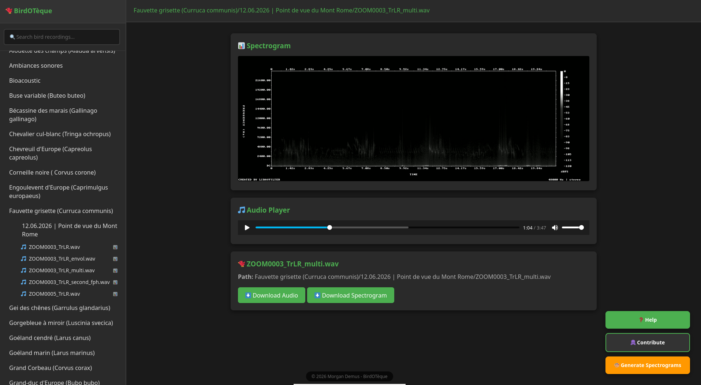
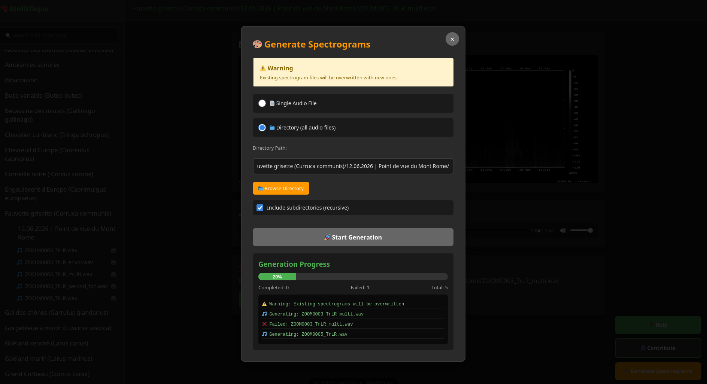
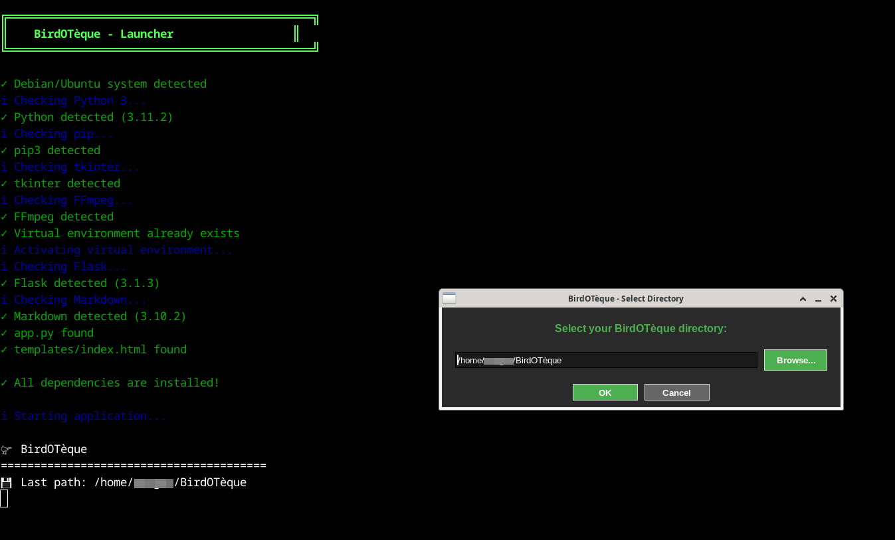

# 🐦 BirdOTèque

Visualize and navigate bird song recordings with integrated audio player and automatic spectrogram visualization.

## 📸 Preview

**Main Interface:**

**Generation spectrogram:**

**Prompt preview:**

## ✨ Features

- **Tree Navigation**: Intuitively browse your folders and bird song audio files.
- **Integrated Audio Player**: Play bird songs directly in the browser.
- **Spectrogram Visualization**: View frequency analysis of bird calls (grayscale, like xeno-canto.org).
- **Automatic Generation**: Generates spectrograms on-the-fly using FFmpeg if they don't exist.
- **Quick Search**: Instantly find a recording by species name or location.
- **Download**: Easily retrieve your audio files and spectrograms.
- **Modern Interface**: Clean, dark, and ergonomic design.

## 📦 Installation

### Prerequisites

- **Debian/Ubuntu** (or any Debian-based distribution)
- **Python 3** (version 3.6 or higher)
- **FFmpeg** (required for automatic spectrogram generation)

### Quick Installation

**Clone the repository**:
git clone https://github.com/MDitor-map/BirdOT-eque.git
cd BirdOT-eque

## Command Line Usage - generate_spectrogram.py
Quick guide to generate spectrograms from terminal.

### Basic Commands

**Single file:**
./generate_spectrogram.py /path/to/audio.wav

**Directory:**
./generate_spectrogram.py /path/to/folder

**Recursive (with subdirectories):**
./generate_spectrogram.py /path/to/folder -r

### Options

-w, --width WIDTH      Width in pixels (default: 1200)
-ht, --height HEIGHT   Height in pixels (default: 400)
-r, --recursive        Process subdirectories
-h, --help             Show help

### Examples

Custom size:
./generate_spectrogram.py audio.wav -w 1600 -ht 500

Batch processing:
./generate_spectrogram.py /folder -r -w 1920 -ht 600

## Notes

- Output: PNG (grayscale)
- Default size: 1200x400px
- Formats: WAV, MP3, OGG, FLAC, M4A
- Existing files are overwritten
- PNG saved in same folder as audio file
